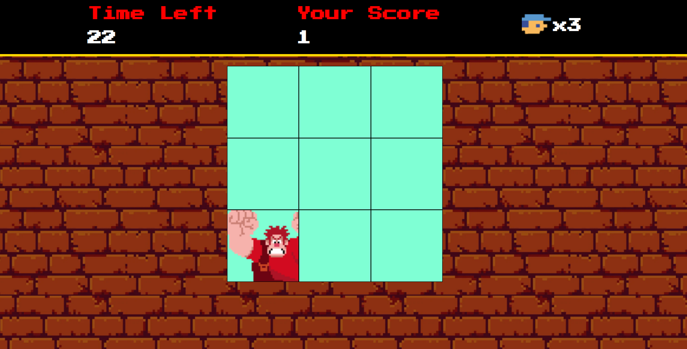

# Detona Ralph Game 👾

Prepare-se para se divertir com este jogo simples e envolvente, inspirado no clássico filme da Disney Detona Ralph.

Além de proporcionar entretenimento, este projeto também demonstra várias técnicas avançadas de desenvolvimento de jogos em JavaScript.

Desenvolvido durante o Bootcamp da DIO em parceria com a Ri Happy - Coding the Future, sob a orientação do instrutor Felipe Aguiar.

## Tecnologias Utilizadas 📱
- HTML e CSS 
- JavaScript

## Como jogar 🎮
1. Clone este repositório para sua máquina local.

2. Abra o arquivo `index.html` em seu navegador.

3. Aproveite o jogo, explore o cenário, colete moedas e enfrente os inimigos!

Fique de olho na sua pontuação enquanto avança e desafie seus amigos a baterem seu recorde. Clique no quadrado onde o Ralph está para testar suas habilidades!

